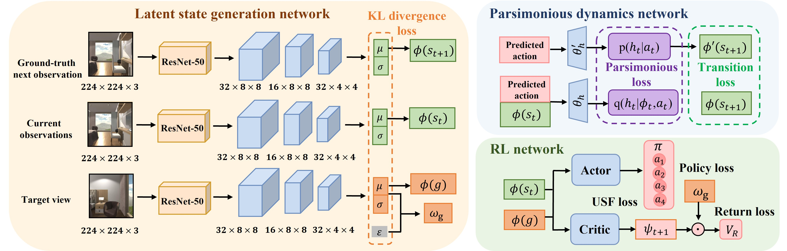
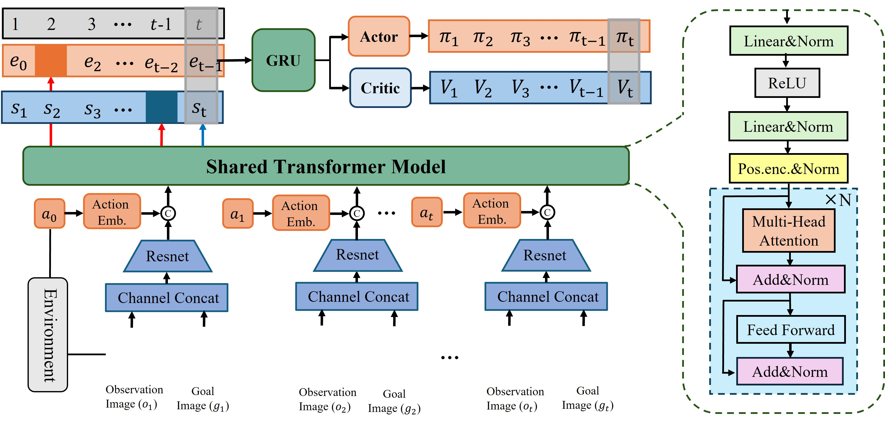

# 智能导航强化学习算法研究  
**作者：CPNT睡觉王**  

---  

## 1. 研究论文汇总  

### 1.1 [Hu J, Ma Y, Jiang H, et al. A new representation of universal successor features for enhancing the generalization of target-driven visual navigation[J]. IEEE Robotics and Automation Letters, 2024.](#)  
#### 研究背景  
- **问题定义**：目标驱动的视觉导航任务中，如何提升智能体的泛化能力？  
- **研究意义**：传统方法在新目标或新环境中表现较差，缺乏通用性。  
- **挑战**：  
  - 状态空间复杂，目标多样。  
  - 现有方法对目标的表示能力有限。  

#### 研究方法  
- 提出了一种新的通用后继特征（Universal Successor Features, USF）表示方法。  
- 通过强化学习框架结合目标嵌入（Goal Embedding）和特征分解，提升目标驱动导航的泛化能力。  
- **核心算法**：  
  - 使用深度神经网络学习后继特征。  
  - 设计了目标条件化策略网络，结合目标特征进行导航。  

#### 实验结果  
- **数据集**：在多个模拟环境（如AI2-THOR、Habitat）中进行测试。  
- **性能指标**：成功率（SR）、路径效率（SPL）。  
- **实验结论**：  
  - 提出的USF方法在新目标和新环境中表现优于现有方法。  
  - 泛化能力显著提升。  

  

---  

### 1.2 [Towards Efficient Image-Goal Navigation: A Self-Supervised Transformer-Based Reinforcement Learning Approach(在投)](#)  
#### 研究背景  
- **问题定义**：如何在图像目标导航任务中提升效率和鲁棒性？  
- **研究意义**：传统方法依赖大量标注数据，训练成本高，泛化能力有限。  
- **挑战**：  
  - 图像目标导航需要高效的视觉特征提取。  
  - 数据稀缺性限制了模型的性能。  

#### 研究方法  
- 提出了一种基于自监督学习的Transformer强化学习框架。  
- **核心创新**：  
  - 使用自监督学习方法预训练视觉特征提取模块。  
  - 设计了基于Transformer的策略网络，增强对长序列依赖的建模能力。  
- **算法流程**：  
  1. 自监督预训练：通过遮掩预测任务（Masked Prediction）学习视觉特征。  
  2. 强化学习：在预训练基础上，使用PPO算法优化策略。  

#### 实验结果  
- **数据集**：在Gibson和Matterport3D环境中进行实验。  
- **性能指标**：成功率（SR）、路径效率（SPL）、训练时间。  
- **实验结论**：  
  - 自监督预训练显著减少了训练时间。  
  - 提出的Transformer策略网络在复杂环境中表现优异。  

  

---  

### 1.3 [Learning Stochastic World Models with VAE-Transformer for Visual Navigation（进展中）](#)  
#### 研究背景  
- **问题定义**：如何在视觉导航任务中构建高效的世界模型？  
- **研究意义**：传统方法依赖确定性模型，难以处理环境中的随机性和不确定性。  
- **挑战**：  
  - 环境动态变化，状态转移具有随机性。  
  - 世界模型需要同时具备高效性和准确性。  

#### 研究方法  
- 提出了一种基于VAE-Transformer的随机世界模型学习方法。  
- **核心创新**：  
  - 使用变分自编码器（VAE）学习潜在空间表示。  
  - 结合Transformer建模时间序列中的随机性。  
- **算法流程**：  
  1. 使用VAE对环境状态进行编码，生成潜在变量。  
  2. 使用Transformer对潜在变量进行时间序列建模。  
  3. 在强化学习框架中结合世界模型进行导航。  

#### 实验结果  
- **数据集**：在AI2-THOR和Habitat环境中进行测试。  
- **性能指标**：导航成功率、模型预测误差。  
- **实验结论**：  
  - 提出的VAE-Transformer模型能够有效捕捉环境中的随机性。  
  - 在复杂环境中导航性能优于传统方法。  

  

---  

