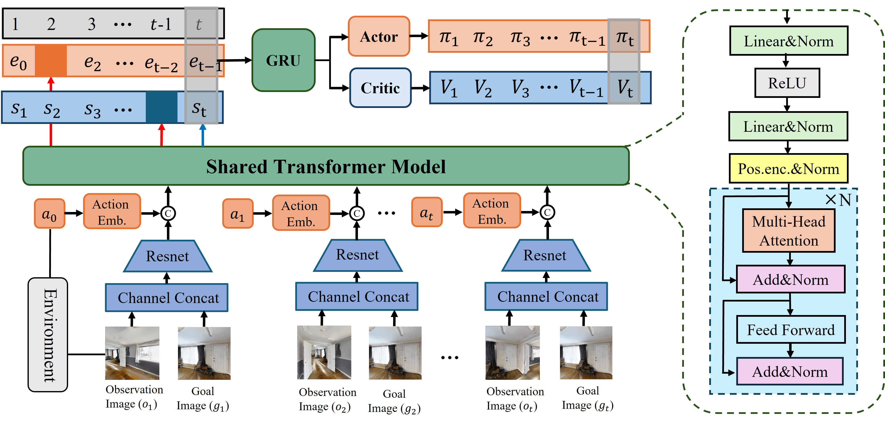
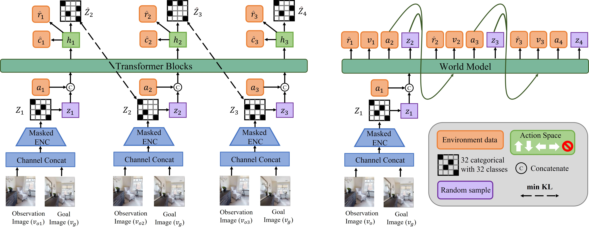

# 🤖 Intelligent Navigation RL Research  

[](https://choosealicense.com/licenses/mit/)
[](https://www.python.org/)
[](https://aihabitat.org/docs/habitat-lab/)
[](https://github.com/hujch23/World-Model-Navigation/issues)
## 📚 Content

- [0. Overview](#🌟0.Overview)
- [1. Model-free-I-Image-goal Navigation](#🔬1.Model-free-I)
- [2. Model-free-II-Image-goal Navigation](#2.Model-free-II)
- [3. Model-based-I-Image-goal Navigation](#3.Model-based-IVisuaLanguagelNavigation)
- [4. Model-based-II-Visual Language Navigation](#4.Mode-l-based-IIVisualLanguageNavigation)
- [5. Install and Prepare Datasets for Image-goal Navigation](#5.InstallandPreparedataset)


## 🌟 0. Overview

To address the challenges of **low learning efficiency, poor generalization, and sim-to-real transfer** in reinforcement learning for visual navigation tasks, we focus on image-goal navigation in the Habitat simulator and explore a technical pathway from model-free to model-based reinforcement learning approaches. Compared with existing methods on the image-goal navigation benchmark, our approach demonstrates significant performance improvements across three standard benchmark datasets (Gibson, MP3D, and HM3D).

---  
 


## 🔬 1. Model-free-I

🙌 Official implementation of IEEE Robotics and Automation Letters accepted paper ["A New Representation of Universal Successor Features for Enhancing the Generalization of Target-driven Visual Navigation"](https://ieeexplore.ieee.org/document/10623277)

---  
#### 🚀 1.1 Research Background 
- **Problem Definition**: How to address poor generalization in reinforcement learning for visual navigation task.  
- **Research Significance**: Traditional methods perform poorly in new targets or environments, lacking universality.  
- **Challenges**: Complex state spaces and diverse goal representations.

#### 🛰️ 1.2 Research Methods  
- The framework incorporates Successor Features into the A3C architecture.（Derived from cognitive science principles, SF emulates neural mechanisms for constructing reusable predictive maps. This approach achieves reward-dynamics decomposition, facilitating rapid policy adaptation to reward modifications and enabling the acquisition of transferable environmental dynamics representations across task distributions.）📝 中文翻译：将SF与A3C算法结合。SF源自认知科学领域，模拟大脑如何创建可重用的预测地图。将奖励和环境动态解耦，使得策略可以快速适应奖励变化，能够学习多个任务之间可迁移的环境动态表征。
- Implementation of state-feature-based prediction mechanisms to establish parsimonious dynamics models in latent space for SF estimation. 📝 中文翻译：使用状态特征预测SF来创建潜在的简约动力学模型。
- Acquisition of compact rule sets within the latent state manifold to optimize successor feature prediction and extraction, enhancing the model's representational capacity.📝 中文翻译：在潜在状态中学习规则集，有助于预测和获取后继特征。

  
  
#### 🏆 1.3 Experimental Results  
- **Datasets**: Tested in multiple simulation environments (e.g., AI2-THOR, Habitat). 
- **Performance Metrics**:
  - Success Rate (SR)
  - Success weighted by Path Length (SPL)
  - Continuous Learning Performance 
- **Conclusions**:
  - Achieving state-of-the-art performance in the generalization of target, scenarios, and domains.
  - Demonstrating strong resistance to catastrophic forgetting in continual learning.


## 🔮 2. Model-free-II
---  
🙌 Official implementation of IROS 2025 under-review paper "Towards Efficient Image-Goal Navigation: A Self-Supervised Transformer-Based Reinforcement Learning Approach".

#### 🚀 2.1 Research Background 
- **Problem Definition**: How to improve the cross-scene and cross-domain generalization ability in visual navigation, enabling agents to effectively navigate to target locations in new environments.  
- **Research Significance**: Existing methods face challenges in handling long-term temporal information and cross-domain generalization. There is a need for more effective visual representation learning and temporal information processing methods.  
- **Challenges**:
  - Simultaneous processing of high-dimensional visual inputs and complex temporal dependencies.
  - Challenges from dynamic camera parameter settings in real-world scenarios.

#### 🛰️ 2.2 Research Methods  
- Designed a Transformer-based dual attention mechanism framework.
- Bidirectional attention for masked prediction learning to enhance representation capability.
-  Causal attention for generating belief states to guide policy decisions.
-  Shared Transformer network to reduce parameter count.

  

#### 🏆 2.3 Experimental Results  
- **Datasets**:
  - Gibson dataset (training and testing).
  - MP3D and HM3D datasets (cross-domain testing).
  - Categorized by difficulty: easy (1.5-3m), medium (3-5m), and hard (5-10m). 
- **Performance Metrics**:
  - Success Rate (SR)
  - Success weighted by Path Length (SPL)
- **Conclusions**:  
  - Achieved state-of-the-art performance on Gibson dataset, demonstrating superior navigation capabilities (SR 91.7%, SPL 68.5%).
  - Exhibited robust cross-domain generalization, maintaining consistent performance across diverse environments (MP3D: SR 79.1%, SPL 52.8%; HM3D: SR 79.1%, SPL 46.6%).
  - Demonstrated remarkable resilience to dynamic camera parameters (height: 0.8m-1.5m, pitch: ±5°, FoV: 60°-120°) (Gibson SR 74.1%, SPL 48.9%).
  - Demonstrated successful real-world deployment on a mobile robot equipped with NVIDIA Jetson Orin NX, achieving reliable navigation performance in cluttered office environments.
    

## 🎯 3. Model-based（World Model）
---  

🙌 Official implementation of CoRL 2025 under-preparation paper "Learning Stochastic World Models with CVAE-Transformer for Visual Navigation (In Progress)"

#### 🚀 3.1 Research Background  
- **Problem Definition**: Model-based visual navigation methods face challenges in modeling environmental uncertainty and accumulating prediction errors during long-horizon planning. Current approaches using deterministic world models often fail to capture the stochastic nature of real-world environments
- **Research Significance**:
  - Sample Efficiency: Model-based methods enable self-supervised learning of environment dynamics, significantly improving sample efficiency compared to model-free approaches
  - Uncertainty Modeling: Existing methods lack robust uncertainty quantification, leading to potential navigation failures
  - Training Efficiency: Current world models require lengthy training periods with limited performance gains
- **Challenges**:  
  - Prediction Error Accumulation：Auto-regressive "imagination" processes lead to compounding errors、Trajectory deviations cause agents to pursue virtual targets  
  - Environmental Complexity：Dynamic and uncertain real-world environments、Complex state transitions and action effects

#### 🛰️ 3.2 Research Methods   
- We propose a stochastic Transformer-based world model that combines a Categorical VAE for robust state encoding with a GPT-style causal architecture for efficient sequence modeling
- The CVAE encoder improves agent robustness and reduces cumulative errors in auto-regressive prediction by capturing environmental uncertainties in a structured latent space
- The causal Transformer with identifiable factorization enhances both modeling quality and generation capabilities while accelerating the training process through efficient temporal dependency learning  

 

#### 🏆 3.3 Experimental Results  

🗂️ [Research in progress, results pending]

## 🧸 4. Visual language navigation world model
🗂️ [Research in progress, results pending]

## 🏂 5. Install and Prepare Datasets for Image-goal Navigation

### 👒 5.1 Install habitat-lab 
```bash
# clone our repo
git clone https://github.com/hujch23/World-Model-Navigation.git
cd World-Model-Navigation

# clone habitat-lab code
git submodule init
git submodule update

# create conda env
conda create -n World-Model-Navigation python=3.8

# install habitat-sim
conda install habitat-sim=0.2.2 withbullet headless -c conda-forge -c aihabitat

# install pytorch1.11
pip install torch==1.11.0+cu113 torchvision==0.12.0+cu113 -f https://download.pytorch.org/whl/torch_stable.html

# install habitat-lab and habitat-baselines
cd habitat-lab
git checkout 1f7cfbdd3debc825f1f2fd4b9e1a8d6d4bc9bfc7
pip install -e habitat-lab 
pip install -e habitat-baselines

pip install -r requirements.txt
```

### 🗂️ 5.2  Download Scene Datasets
You can download the datasets from https://github.com/XinyuSun/FGPrompt. As mentioned in the repository, follow the official guidelines to download Gibson, HM3D, and MP3D scene datasets and place them in the data/scene_datasets directory.

### 📑 5.3  Prepare Train and Test episodes
We provide the script `datasets.py` to ensure the smooth loading of both curved and straight test episodes.


