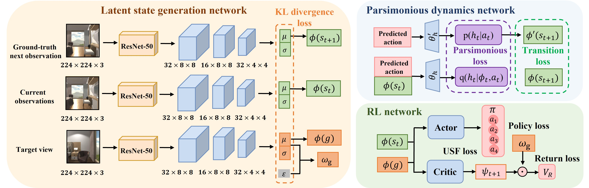

# 🤖 Intelligent Navigation RL Research  

"To address the challenges of **low learning efficiency and poor generalization** in reinforcement learning for visual navigation tasks, we focus on image-goal navigation in the Habitat simulator and explore a technical pathway from model-free to model-based reinforcement learning approaches. Compared with existing methods on the image-goal navigation benchmark, our approach demonstrates significant performance improvements across three standard benchmark datasets (Gibson, MP3D, and HM3D)."

---  

## 🚀 1. Model-free

🙌 Official implementation of IEEE Robotics and Automation Letters accepted paper ["A New Representation of Universal Successor Features for Enhancing the Generalization of Target-driven Visual Navigation"](https://ieeexplore.ieee.org/document/10623277)

---  
#### 🍔 1.1 Research Background 
- **Problem Definition**: How to enhance agent generalization in target-driven visual navigation tasks?  
- **Research Significance**: Traditional methods perform poorly in new targets or environments, lacking universality.  
- **Challenges**: Complex state space and diverse targets  

#### 🛰️ 1.2 Research Methods  
- The framework incorporates Successor Features into the A3C architecture.（Derived from cognitive science principles, SF emulates neural mechanisms for constructing reusable predictive maps. This approach achieves reward-dynamics decomposition, facilitating rapid policy adaptation to reward modifications and enabling the acquisition of transferable environmental dynamics representations across task distributions.）
- 
 
📝 中文翻译
将SF与A3C算法结合。SF源自认知科学领域，模拟大脑如何创建可重用的预测地图。将奖励和环境动态解耦，使得策略可以快速适应奖励变化，能够学习多个任务之间可迁移的环境动态表征。

- Implementation of state-feature-based prediction mechanisms to establish parsimonious dynamics models in latent space for SF estimation.
- 
 
📝 中文翻译
使用状态特征预测SF来创建潜在的简约动力学模型。

- Acquisition of compact rule sets within the latent state manifold to optimize successor feature prediction and extraction, enhancing the model's representational capacity.
 
📝 中文翻译
在潜在状态中学习规则集，有助于预测和获取后继特征。

  
  
#### 🏆 1.3 Experimental Results  
- **Datasets**: Tested in multiple simulation environments (e.g., AI2-THOR, Habitat)  
- **Performance Metrics**: Success Rate (SR), Success weighted by Path Length (SPL)  
- **Conclusions**:  
  - Proposed USF method outperforms existing approaches in new targets and environments  
  - Significant improvement in generalization capability  

## 🚀 2. Model-free
---  
🙌 Official implementation of IROS 2025 under-review paper "Towards Efficient Image-Goal Navigation: A Self-Supervised Transformer-Based Reinforcement Learning Approach"

#### 🍔 2.1 Research Background 
- **Problem Definition**: How to improve efficiency and robustness in image-goal navigation tasks?  
- **Research Significance**: Traditional methods rely on extensive labeled data, high training costs, limited generalization  
- **Challenges**:  
  - Efficient visual feature extraction needed for image-goal navigation  
  - Data scarcity limiting model performance  

#### 🛰️ 2.2 Research Methods  
- Proposed a self-supervised Transformer-based reinforcement learning framework  
- **Core Innovations**:  
  - Self-supervised learning for pre-training visual feature extraction module  
  - Designed Transformer-based policy network enhancing long-sequence dependency modeling  
- **Algorithm Flow**:  
  1. Self-supervised Pre-training: Learning visual features through masked prediction tasks  
  2. Reinforcement Learning: Optimizing policy using PPO algorithm based on pre-training  

#### 🏆 2.3 Experimental Results  
- **Datasets**: Experiments conducted in Gibson and Matterport3D environments  
- **Performance Metrics**: Success Rate (SR), SPL, Training Time  
- **Conclusions**:  
  - Self-supervised pre-training significantly reduced training time  
  - Proposed Transformer policy network excels in complex environments  

  

## 🚀 3. Model-based
---  

🙌 Official implementation of CoRL 2025 under-preparation paper "Learning Stochastic World Models with VAE-Transformer for Visual Navigation (In Progress)"

#### 🍔 3.1 Research Background  
- **Problem Definition**: How to model environmental uncertainty in visual navigation?  
- **Research Significance**: Current world models lack stochastic modeling capabilities  
- **Challenges**:  
  - Complex environmental dynamics  
  - Uncertainty quantification in navigation  

#### 🛰️ 3.2 Research Methods   
- Developing a VAE-Transformer hybrid architecture for world modeling  
- **Core Components**:  
  - VAE for stochastic state representation  
  - Transformer for temporal dependency modeling  
- **Key Features**:  
  - Probabilistic state transitions  
  - Uncertainty-aware planning  

#### 🏆 3.3 Experimental Results  
- **Metrics**:  
  - Navigation success rate under uncertainty  
  - Model prediction accuracy  
- **Potential Impact**:  
  - More robust navigation in uncertain environments  
  - Better generalization to real-world scenarios
  

🗂️ [Research in progress, results pending]
