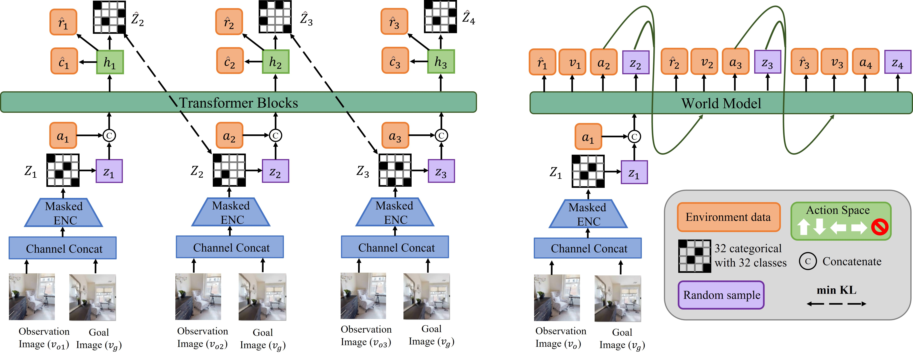

# 智能导航强化学习算法研究  CPNT睡觉王
Hu J, Ma Y, Jiang H, et al. A new representation of universal successor features for enhancing the generalization of target-driven visual navigation[J]. IEEE Robotics and Automation Letters, 2024.

Towards Efficient Image-Goal Navigation: A Self-Supervised Transformer-Based Reinforcement Learning Approach
Learning Stochastic World Models with VAE-Transformer for Visual Navigation

 
